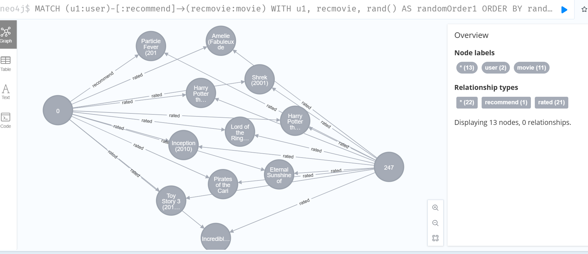

1. **Q: 这个项目是干什么的**
   - 这个项目通过读取本地的csv文件，来获得用户-电影评分表，然后基于协同算法来计算出需要推荐给某一个用户的电影
   - 然后再将协同推荐的结果展示到图数据库中来可视化


2. **Q: 我该怎么运行这个项目?**
   - 您需要首先配置好[neo4j](https://blog.csdn.net/zsh1184528359/article/details/105893647)数据库
   - 配置好本项目目录下的`config.yaml`，输入您的数据库的密码，数据库url，数据库名称
   - 配置完成之后在命令行输入`neo4j console`来启动数据库(也就是本项目中的`runneo4j.bat`脚本)
   - 然后运行项目中的`main.py`
   - 打开相关的数据库界面
   - 输入相关的查询语句
     ```
     MATCH (u1:user)-[:recommend]->(recmovie:movie)
     WITH u1, recmovie, rand() AS randomOrder1
     ORDER BY randomOrder1
     LIMIT 1
     MATCH (u2:user)-[ratingRelation:`rated`]->(recmovie)
     WITH u1, u2,recmovie,rand() AS randomOrder2
     order by randomOrder2
     LIMIT 2
     MATCH (u1)-[:`rated`]->(commonMovie:movie)<-[:`rated`]-(u2)
     RETURN u1, u2, collect(commonMovie) AS CommonMovies,recmovie
     ```
     你会得到这张图片
     
     这或许会帮助你探究你被推荐到某部电影的原因(是不是有一个和你兴趣爱好相似的用户喜爱了这部电影)

3. **Q: 我该怎么改变我目前的电影评分?**
   - 你可以在`main.py`中的代码块中修改你的电影评分
   ```
    # Check the file small_movie_list.csv for id of each movie in our dataset
    # For example, Toy Story 3 (2010) has ID 2700, so to rate it "5", you can set
    my_ratings[2700] = 5
    # Or suppose you did not enjoy Persuasion (2007), you can set
    my_ratings[2609] = 2
    # We have selected a few movies we liked / did not like and the ratings we
    # gave are as follows:
    my_ratings[929] = 5  # Lord of the Rings: The Return of the King, The
    my_ratings[246] = 5  # Shrek (2001)
    my_ratings[2716] = 3  # Inception
    my_ratings[1150] = 5  # Incredibles, The (2004)
    my_ratings[382] = 2  # Amelie (Fabuleux destin d'Amélie Poulain, Le)
    my_ratings[366] = 5  # Harry Potter and the Sorcerer's Stone (a.k.a. Harry Potter and the Philosopher's Stone) (2001)
    my_ratings[622] = 5  # Harry Potter and the Chamber of Secrets (2002)
    my_ratings[988] = 3  # Eternal Sunshine of the Spotless Mind (2004)
    my_ratings[2925] = 1  # Louis Theroux: Law & Disorder (2008)
    my_ratings[2937] = 1  # Nothing to Declare (Rien à déclarer)
    my_ratings[793] = 5  # Pirates of the Caribbean: The Curse of the Black Pearl (2003)
    ```

4. **Q: 我该怎么联系到作者?**
   - 你可以通过我的qq邮箱`1023097618@qq.com`来联系到我